<h1 align="center">Hi 👋, I'm Artur</h1>

  

- 📚 Computer Science engineering graduate at University of Wrocław [my work](https://github.com/ArturBieniek4/University) [my thesis](https://github.com/ArturBieniek4/engineering-thesis)

- 🌱 I’m currently learning **CPU core design, FPGAs, Networking, Advanced SQL**

- 🔭 I’m currently working on **Vast.AI GPU rigs, generating branch predictors using LLMs, DRAM refresh rate hacking**

<h3 align="left">Languages and Tools:</h3>
<table border="0" cellpadding="0" cellspacing="0">
  <tr>
    <td width="58"></td>
    <td width="58"></td>
    <td width="58"></td>
    <td width="58"></td>
    <td width="58"></td>
    <td width="58"></td>
    <td width="58"></td>
    <td width="58"></td>
  </tr>
</table>

